# DADS
Reproducing the results of the Dynamics-Aware Unsupervised Discovery of Skills paper (ICLR 2020)

作者[开源代码](https://github.com/google-research/dads)是基于**tensorflow2**实现的，我习惯用**pytorch**，这里尝试基于**pytorch**来复现（怕是给自己挖了个大坑），原仓库已经很久没更新了，并且作者也没有理会**issue**，怕是源码都有问题，这让我有些慌。先整着，不行就G。

## Why is DADS?

选这篇工作的主要目的是，做一个无监督强化学习的持续性学习，上一篇刚好是[DIAYN](https://github.com/IDayday/DIAYN-PyTorch)，得益于它的实现效果和简洁的代码，让我对系列工作有了自信，所以跟踪这个工作，找到了这篇DADS，引用**195**[截止22.9.16]，应该还阔以。

DADS是将**无监督与基于模型的强化学习**结合起来，这就触及到我的盲点了，我对model-base了解不多，边看论文别学习吧。

后续不打算在**git**上记录学习过程，主要还是以代码复现为主，如果复现成功，再抽时间录个视频分享一下。

## Results

同样基于SAC的DADS实现初版已经进行了一次测试，虽说是model-base的方法，但我更感兴趣的是它的skill表现如何，之后会做与DIAYN的对比测试。

#### Ant-v3

|       |skill 0| skill 1| skill 2| skill 3|
:-----------------------:|:-----------------------:|:-----------------------:|:-----------------------:|:-----------------------:
|visualization|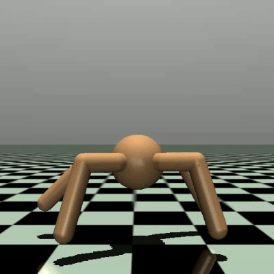| 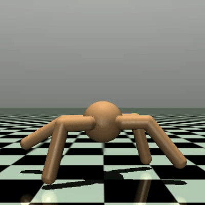| 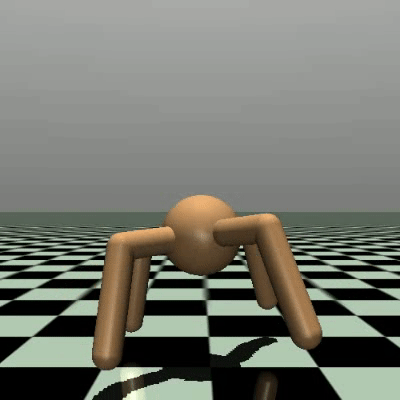| 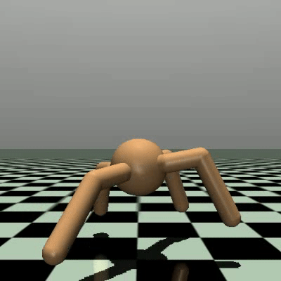
episode reward|-415.9|-422.9|-82.2|-380.8|
episode step|1000|1000|308|1000

* 似乎有点呆，而且大多都是四脚朝天，没有沿着某个方向探索地图中的某块区域，并且这个输入的状态空间是进行了裁剪，与paper一致。

#### Hopper-v3

|       |skill 0| skill 1| skill 2| skill 3|
:-----------------------:|:-----------------------:|:-----------------------:|:-----------------------:|:-----------------------:
|visualization|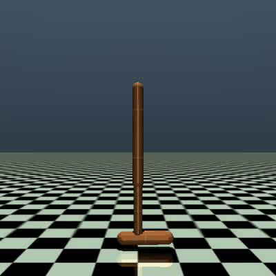| | 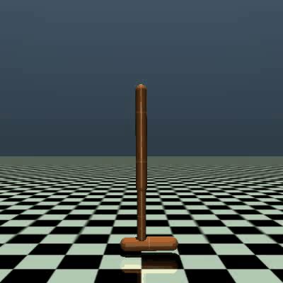| 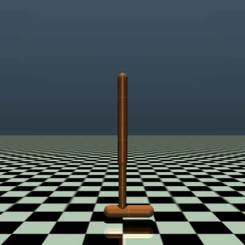
episode reward|80.9|109.0|169.2|79.8|
episode step|250|250|250|250

* 这个效果很差，基本的静态平衡都没学会，前进后退就更别提了，远不如DIAYN

#### HalfCheetah-v3
|       |skill 0| skill 1| skill 2| skill 3|
:-----------------------:|:-----------------------:|:-----------------------:|:-----------------------:|:-----------------------:
|visualization|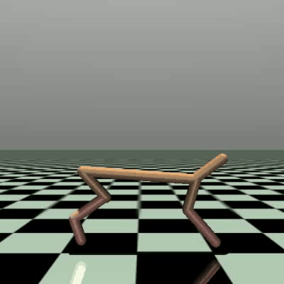| 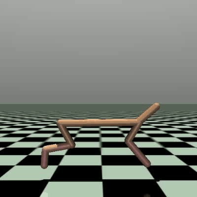| 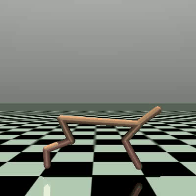| 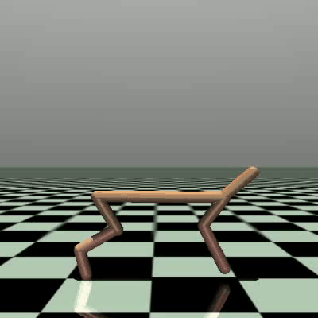
episode reward|-258.0|-409.3|-180.6|-296.2|
episode step|1000|1000|308|1000

* 没有明显的前进后退，总是倾向于脸贴地或者原地鬼畜

[DIAYN](https://github.com/IDayday/DIAYN-PyTorch)效果对比

## TODO

- [x] Hopper-v3 n_skill=20
- [x] HalfCheetah-v3 n_skill=20
- [ ] 核对实现方法和训练细节